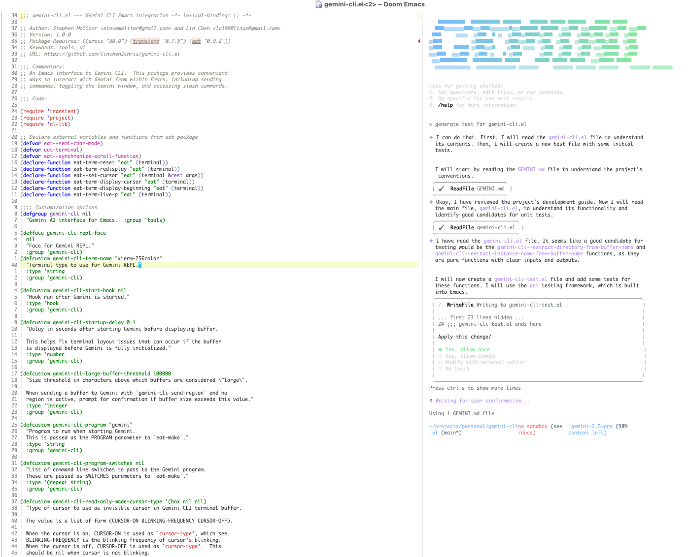

# gemini-cli.el



An Emacs interface for [Gemini CLI](https://blog.google/technology/developers/introducing-gemini-cli-open-source-ai-agent/), providing integration between Emacs and Gemini AI for coding assistance.

## Features

- **Seamless Emacs Integration** - Start, manage, and interact with Gemini without leaving Emacs
- **Stay in Your Buffer** - Send code, regions, or commands to Gemini while keeping your focus
- **Fix Errors Instantly** - Point at a flycheck/flymake error and ask Gemini to fix it
- **Multiple Instances** - Run separate Gemini sessions for different projects or tasks
- **Quick Responses** - Answer Gemini with a keystroke (<return>/<escape>/1/2/3) without switching buffers
- **Smart Context** - Optionally include file paths and line numbers when sending commands to Gemini
- **Transient Menu** - Access all commands and slash commands through a transient menu
- **Continue Conversations** - Resume previous sessions or fork to earlier points
- **Read-Only Mode** - Toggle to select and copy text with normal Emacs commands and keybindings
- **Mode Cycling** - Quick switch between default, auto-accept edits, and plan modes
- **Desktop Notifications** - Get notified when Gemini finishes processing
- **Terminal Choice** - Works with both eat and vterm backends
- **Fully Customizable** - Configure keybindings, notifications, and display preferences

## Installation {#installation}

### Prerequisites

- Emacs 30.0 or higher
- [Gemini CLI](https://github.com/google-gemini/gemini-cli) installed and configured
- Required: transient (0.7.5+)
- Optional: eat (0.9.2+) for eat backend, vterm for vterm backend
- Note: If not using a `:vc` install, the `eat` package requires NonGNU ELPA:
    ```elisp
    (add-to-list 'package-archives '("nongnu" . "https://elpa.nongnu.org/nongnu/"))
    ```

### Using builtin use-package (Emacs 30+)

```elisp
;; add melp to package archives, as vterm is on melpa:
(require 'package)
(add-to-list 'package-archives '("melpa" . "https://melpa.org/packages/") t)
(package-initialize)

;; for eat terminal backend:
(use-package eat :ensure t)

;; for vterm terminal backend:
(use-package vterm :ensure t)

;; install gemini-cli.el
(use-package gemini-cli :ensure t
  :vc (:url "https://github.com/linchen2chris/gemini-cli.el" :rev :newest)
  :config (gemini-cli-mode)
  :bind-keymap ("C-c c" . gemini-cli-command-map)) ;; or your preferred key
```

### Using straight.el

```elisp
;; for eat terminal backend:
(use-package eat
  :straight (:type git
                   :host codeberg
                   :repo "akib/emacs-eat"
                   :files ("*.el" ("term" "term/*.el") "*.texi"
                           "*.ti" ("terminfo/e" "terminfo/e/*")
                           ("terminfo/65" "terminfo/65/*")
                           ("integration" "integration/*")
                           (:exclude ".dir-locals.el" "*-tests.el"))))

;; for vterm terminal backend:
(use-package vterm :straight t)

(use-package gemini-cli
  :straight (:type git :host github :repo "linchen2chris/gemini-cli.el" :branch "main"
                   :files ("*.el" (:exclude "demo.gif")))
  :bind-keymap
  ("C-c c" . gemini-cli-command-map)
  :config
  (gemini-cli-mode))
```

## Basic Usage

### Setting Prefix Key
You need to set your own key binding for the Gemini CLI command map, as described in the [Installation](#installation) section. The examples in this README use `C-c c` as the prefix key.

### Picking Eat or Vterm

By default gemini-cli.el uses the `eat` backend. If you prefer vterm customize
`gemini-cli-terminal-backend`:

```elisp
(setq gemini-cli-terminal-backend 'vterm)
```

### Transient Menu

You can see a menu of the important commands by invoking the transient, `gemini-cli-transient` (`C-c c m`):


### Starting and Stopping Gemini

To start Gemini, run `gemini-cli` (`C-c c c`). This will start a new Gemini instance in the root
project directory of the buffer file, or the current directory if outside of a project.
Gemini-code.el uses Emacs built-in
[project.el](https://www.gnu.org/software/emacs/manual/html_node/emacs/Projects.html) which works
with most version control systems.

To start Gemini in a specific directory use `gemini-cli-start-in-directory` (`C-c c d`). It will
prompt you for the directory.

The `gemini-cli-continue` command will continue the previous conversation, and `gemini-cli-resume` will let you pick from a list of previous sessions.

To kill the Gemini process and close its window use `gemini-cli-kill` (`C-c c k`).

### Sending Commands to Gemini

Once Gemini has started, you can switch to the Gemini buffer and start entering prompts.
Alternately, you can send prompts to Gemini using the minibuffer via `gemini-cli-send-command`
(`C-c c s`). `gemini-cli-send-command-with-context` (`C-c c x`) will also send the current file name and line
number to Gemini. This is useful for asking things like "what does this code do?", or "fix the bug
in this code".

Use the `gemini-cli-send-region` (`C-c c r`) command to send the selected region to Gemini, or the entire buffer if no region is selected. This command is useful for writing a prompt in a regular Emacs buffer and sending it to Gemini. With a single prefix arg (`C-u C-c c r`) it will prompt for extra context before sending the region to Gemini.

You can also send files directly to Gemini using `gemini-cli-send-file` to send any file by path, or `gemini-cli-send-buffer-file` (`C-c c o`) to send the file associated with the current buffer. The `gemini-cli-send-buffer-file` command supports prefix arguments similar to `gemini-cli-send-region` - with a single prefix arg it prompts for instructions, and with double prefix it also switches to the Gemini buffer.

If you put your cursor over a flymake or flycheck error, you can ask Gemini to fix it via `gemini-cli-fix-error-at-point` (`C-c c e`).

To show and hide the Gemini buffer use `gemini-cli-toggle` (`C-c c t`).  To jump to the Gemini buffer use `gemini-cli-switch-to-buffer` (`C-c c b`). This will open the buffer if hidden.

### Managing Gemini Windows

The `gemini-cli-toggle` (`C-c c t`) will show and hide the Gemini window. Use the `gemini-cli-switch-to-buffer` (`C-c c b`) command to switch to the Gemini window even if it is hidden. 

To enter read-only mode in the Gemini buffer use `gemini-cli-toggle-read-only-mode` (`C-c c z`). In this mode you can select and copy text, and use regular Emacs keybindings. To exit read-only mode invoke `gemini-cli-toggle-read-only-mode` again.

### Quick Responses

Sometimes you want to send a quick response to Gemini without switching to the Gemini buffer. The following commands let you answer a query from Gemini without leaving your current editing buffer:

- `gemini-cli-send-return` (`C-c c y`) - send the return or enter key to Gemini, commonly used to respond with "Yes" to Gemini queriesy
- `gemini-cli-send-escape` (`C-c c n`) - send the escape key, to say "No" to Gemini or to cancel a running Gemini action
- `gemini-cli-send-1` (`C-c c 1`) - send "1" to Gemini, to choose option "1" in response to a Gemini query
- `gemini-cli-send-2` (`C-c c 2`) - send "2" to Gemini
- `gemini-cli-send-3` (`C-c c 3`) - send "3" to Gemini

## Working with Multiple Gemini Instances

`gemini-cli.el` supports running multiple Gemini instances across different projects and directories. Each Gemini instance is associated with a specific directory (project root, file directory, or current directory).

#### Instance Management

- When you start Gemini with `gemini-cli`, it creates an instance for the current directory
- If a Gemini instance already exists for the directory, you'll be prompted to name the new instance (e.g., "tests", "docs")
- You can also use `gemini-cli-new-instance` to explicitly create a new instance with a custom name
- Buffer names follow the format:
  - `*gemini:/path/to/directory:instance-name*` (e.g., `*gemini:/home/user/project:tests*`)
- If you're in a directory without a Gemini instance but have instances running in other directories, you'll be prompted to select one
- Your selection is remembered for that directory, so you won't be prompted again

### Instance Selection

Commands that operate on an instance (`gemini-send-command`, `gemini-cli-switch-to-buffer`, `gemini-cli-kill`, etc.) will prompt you for the Gemini instance if there is more than one instance associated with the current buffer's project.

If the buffer file is not associated with a running Gemini instance, you can select an instance running in a different project. This is useful when you want Gemini to analyze dependent projects or files that you have checked out in sibling directories.

Gemini-cli.el remembers which buffers are associated with which Gemini instances, so you won't be repeatedly prompted. This association also helps gemini-cli.el "do the right thing" when killing a Gemini process and deleting its associated buffer.

### Multiple Instances Per Directory

You can run multiple Gemini instances for the same directory to support different workflows:

- The first instance in a directory is the "default" instance
- Additional instances require a name when created (e.g., "tests", "docs", "refactor")
- When multiple instances exist for a directory, commands that interact with Gemini will prompt you to select which instance to use
- Use `C-u gemini-cli-switch-to-buffer` to see all Gemini instances across all directories (not just the current directory)
- Use `gemini-cli-select-buffer` as a dedicated command to always show all Gemini instances across all directories

This allows you to have separate Gemini conversations for different aspects of your work within the same project, such as one instance for writing cli and another for writing tests.

## Working in the Gemini Buffer

gemini-cli.el is designed to support using Gemini CLI in Emacs using the minibuffer and regular Emacs buffers, with normal keybindings and full Emacs editing facilities. However, gemini-cli.el also adds a few niceties for working in the Gemini CLI terminal buffer:

You can type `C-g` as an alternative to escape. Also gemini-cli.el supports several options for
entering newlines in the Gemini CLI session:

- **Default (newline-on-shift-return)**: Press `Shift-Return` to insert a newline, `Return` to send your message
- **Alt-return style**: Press `Alt-Return` to insert a newline, `Return` to send
- **Shift-return to send**: Press `Return` to insert a newline, `Shift-Return` to send
- **Super-return to send**: Press `Return` to insert a newline, `Command-Return` (macOS) to send

You can change this behavior by customizing `gemini-cli-newline-keybinding-style` (see [Customization](#customization)).

### Command Reference

- `gemini-cli-transient` (`C-c c m`) - Show all commands (transient menu)
- `gemini-cli` (`C-c c c`) - Start Gemini. With prefix arg (`C-u`), switches to the Gemini buffer after creating. With double prefix (`C-u C-u`), prompts for the project directory
- `gemini-cli-start-in-directory` (`C-c c d`) - Prompt for a directory and start Gemini there. With prefix arg (`C-u`), switches to the Gemini buffer after creating
- `gemini-cli-continue` (`C-c c C`) - Start Gemini and continue the previous conversation. With prefix arg (`C-u`), switches to the Gemini buffer after creating. With double prefix (`C-u C-u`), prompts for the project directory
- `gemini-cli-resume` (`C-c c R`) - Resume a specific Gemini session from an interactive list. With prefix arg (`C-u`), switches to the Gemini buffer after creating. With double prefix (`C-u C-u`), prompts for the project directory
- `gemini-cli-new-instance` (`C-c c i`) - Create a new Gemini instance with a custom name. Always prompts for instance name, unlike `gemini-cli` which uses "default" when no instances exist. With prefix arg (`C-u`), switches to the Gemini buffer after creating. With double prefix (`C-u C-u`), prompts for the project directory
- `gemini-cli-kill` (`C-c c k`) - Kill Gemini session
- `gemini-cli-kill-all` (`C-c c K`) - Kill ALL Gemini instances across all directories
- `gemini-cli-send-command` (`C-c c s`) - Send command to Gemini. With prefix arg (`C-u`), switches to the Gemini buffer after sending
- `gemini-cli-send-command-with-context` (`C-c c x`) - Send command with current file and line context. With prefix arg (`C-u`), switches to the Gemini buffer after sending
- `gemini-cli-send-region` (`C-c c r`) - Send the current region or buffer to Gemini. With prefix arg (`C-u`), prompts for instructions to add to the text. With double prefix (`C-u C-u`), adds instructions and switches to Gemini buffer
- `gemini-cli-send-file` - Send a specified file to Gemini. Prompts for file path
- `gemini-cli-send-buffer-file` (`C-c c o`) - Send the file associated with current buffer to Gemini. With prefix arg (`C-u`), prompts for instructions to add to the file. With double prefix (`C-u C-u`), adds instructions and switches to Gemini buffer
- `gemini-cli-fix-error-at-point` (`C-c c e`) - Ask Gemini to fix the error at the current point (works with flycheck, flymake, and any system that implements help-at-pt). With prefix arg (`C-u`), switches to the Gemini buffer after sending
- `gemini-cli-fork` (`C-c c f`) - Fork conversation (jump to previous conversation by sending escape-escape to Gemini)
- `gemini-cli-slash-commands` (`C-c c /`) - Access Gemini slash commands menu
- `gemini-cli-toggle` (`C-c c t`) - Toggle Gemini window
- `gemini-cli-switch-to-buffer` (`C-c c b`) - Switch to the Gemini buffer. With prefix arg (`C-u`), shows all Gemini instances across all directories
- `gemini-cli-select-buffer` (`C-c c B`) - Select and switch to a Gemini buffer from all running instances across all projects and directories
- `gemini-cli-toggle-read-only-mode` (`C-c c z`) - Toggle between read-only mode and normal mode in Gemini buffer (useful for selecting and copying text)
- `gemini-cli-cycle-mode` (`C-c c M`) - Send Shift-Tab to Gemini to cycle between default mode, auto-accept edits mode, and plan mode

- `gemini-cli-send-return` (`C-c c y`) - Send return key to Gemini (useful for confirming with Gemini without switching to the Gemini REPL buffer) (useful for responding with "Yes"  to Gemini)
- `gemini-cli-send-escape` (`C-c c n`) - Send escape key to Gemini (useful for saying "No" when Gemini asks for confirmation without switching to the Gemini REPL buffer)
- `gemini-cli-send-1` (`C-c c 1`) - Send "1" to Gemini (useful for selecting the first option when Gemini presents a numbered menu)
- `gemini-cli-send-2` (`C-c c 2`) - Send "2" to Gemini (useful for selecting the second option when Gemini presents a numbered menu)
- `gemini-cli-send-3` (`C-c c 3`) - Send "3" to Gemini (useful for selecting the third option when Gemini presents a numbered menu)

## Desktop Notifications

gemini-cli.el notifies you when Gemini finishes processing and is waiting for input. By default, it displays a message in the minibuffer and pulses the modeline for visual feedback.

### macOS Native Notifications

To use macOS native notifications with sound, add this to your configuration:

```elisp
(defun my-gemini-notify (title message)
  "Display a macOS notification with sound."
  (call-process "osascript" nil nil nil
                "-e" (format "display notification \"%s\" with title \"%s\" sound name \"Glass\""
                             message title)))

(setq gemini-cli-notification-function #'my-gemini-notify)
```

This will display a system notification with a "Glass" sound effect when Gemini is ready. You can change the sound name to any system sound (e.g., "Ping", "Hero", "Morse", etc.) or remove the `sound name` part for silent notifications.

### Linux Native Notifications

For Linux desktop notifications, you can use `notify-send` (GNOME/Unity) or `kdialog` (KDE):

```elisp
;; For GNOME/Unity desktops
(defun my-gemini-notify (title message)
  "Display a Linux notification using notify-send."
  (if (executable-find "notify-send")
      (call-process "notify-send" nil nil nil title message)
    (message "%s: %s" title message)))

(setq gemini-cli-notification-function #'my-gemini-notify)
```

To add sound on Linux:

```elisp
(defun my-gemini-notify-with-sound (title message)
  "Display a Linux notification with sound."
  (when (executable-find "notify-send")
    (call-process "notify-send" nil nil nil title message))
  ;; Play sound if paplay is available
  (when (executable-find "paplay")
    (call-process "paplay" nil nil nil "/usr/share/sounds/freedesktop/stereo/message.oga")))

(setq gemini-cli-notification-function #'my-gemini-notify-with-sound)
```

### Windows Native Notifications

For Windows, you can use PowerShell to create toast notifications:

```elisp
(defun my-gemini-notify (title message)
  "Display a Windows notification using PowerShell."
  (call-process "powershell" nil nil nil
                "-NoProfile" "-Command"
                (concat "[Windows.UI.Notifications.ToastNotificationManager, Windows.UI.Notifications, ContentType = WindowsRuntime] | Out-Null; "
                        "$template = '<toast><visual><binding template=\"ToastGeneric\"><text>" title "</text><text>" message "</text></binding></visual></toast>'; "
                        "$xml = New-Object Windows.Data.Xml.Dom.XmlDocument; "
                        "$xml.LoadXml($template); "
                        "$toast = [Windows.UI.Notifications.ToastNotification]::new($xml); "
                        "[Windows.UI.Notifications.ToastNotificationManager]::CreateToastNotifier('Emacs').Show($toast)")))

(setq gemini-cli-notification-function #'my-gemini-notify)
```

*Note: Linux and Windows examples are untested. Feedback and improvements are welcome!*

## Tips and Tricks

- **Paste images**: Use `C-v` to paste images into the Gemini window. Note that on macOS, this is `Control-v`, not `Command-v`.
- **Paste text**: Use `C-y` (`yank`) to paste text into the Gemini window. 
- **Save files before sending commands**: Gemini reads files directly from disk, not from Emacs buffers. Always save your files (`C-x C-s`) before sending commands that reference file content. Consider enabling `global-auto-revert-mode` to automatically sync Emacs buffers with file changes made by Gemini:
  ```elisp
  (global-auto-revert-mode 1)
  ;; If files aren't reliably auto-reverting after Gemini makes changes,
  ;; disable file notification and use polling instead:
  (setq auto-revert-use-notify nil)
  ``` 

## Customization

```elisp
;; Set your key binding for the command map.
(global-set-key (kbd "C-c C-a") gemini-cli-command-map)

;; Set terminal type for the Gemini terminal emulation (default is "xterm-256color").
;; This determines terminal capabilities like color support.
;; See the documentation for eat-term-name for more information.
(setq gemini-cli-term-name "xterm-256color")

;; Change the path to the Gemini executable (default is "gemini").
;; Useful if Gemini is not in your PATH or you want to use a specific version.
(setq gemini-cli-program "/usr/local/bin/gemini")

;; Set command line arguments for Gemini
;; For example, to enable verbose output
(setq gemini-cli-program-switches '("--verbose"))

;; Add hooks to run after Gemini is started
(add-hook 'gemini-cli-start-hook 'my-gemini-setup-function)

;; Adjust initialization delay (default is 0.1 seconds)
;; This helps prevent terminal layout issues if the buffer is displayed before Gemini is fully ready.
(setq gemini-cli-startup-delay 0.2)

;; Configure the buffer size threshold for confirmation prompt (default is 100000 characters)
;; If a buffer is larger than this threshold, gemini-cli-send-region will ask for confirmation
;; before sending the entire buffer to Gemini.
(setq gemini-cli-large-buffer-threshold 100000)

;; Configure key binding style for entering newlines and sending messages in Gemini buffers.
;; Available styles:
;;   'newline-on-shift-return - S-return inserts newline, RET sends message (default)
;;   'newline-on-alt-return   - M-return inserts newline, RET sends message
;;   'shift-return-to-send    - RET inserts newline, S-return sends message
;;   'super-return-to-send    - RET inserts newline, s-return sends message (Command+Return on macOS)
(setq gemini-cli-newline-keybinding-style 'newline-on-shift-return)

;; Enable or disable notifications when Gemini finishes and awaits input (default is t).
(setq gemini-cli-enable-notifications t)

;; Customize the notification function (default is gemini-cli--default-notification).
;; The function should accept two arguments: title and message.
;; The default function displays a message and pulses the modeline for visual feedback.
(setq gemini-cli-notification-function 'gemini-cli--default-notification)

;; Example: Use your own notification function
(defun my-gemini-notification (title message)
  "Custom notification function for Gemini CLI."
  ;; Your custom notification logic here
  (message "[%s] %s" title message))
(setq gemini-cli-notification-function 'my-gemini-notification)

;; Configure kill confirmation behavior (default is t).
;; When t, gemini-cli-kill prompts for confirmation before killing instances.
;; When nil, kills Gemini instances without confirmation.
(setq gemini-cli-confirm-kill t)

;; Enable/disable window resize optimization (default is t)
;; When enabled, terminal reflows are only triggered when window width changes,
;; not when only height changes. This prevents unnecessary redraws when splitting
;; windows vertically, improving performance and reducing visual artifacts.
;; Set to nil if you experience issues with terminal display after resizing.
(setq gemini-cli-optimize-window-resize t)

;; Enable/disable no-delete-other-windows parameter (default is nil)
;; When enabled, Gemini CLI windows have the no-delete-other-windows
;; parameter set. This prevents the Gemini window from being closed
;; when you run delete-other-windows or similar commands, keeping the
;; Gemini buffer visible and accessible.
(setq gemini-cli-no-delete-other-windows t)
```

### Customizing Window Position

You can control how the Gemini Cli window appears using Emacs' `display-buffer-alist`. For example, to make the Gemini window appear in a persistent side window on the right side of your screen with 33% width:

```elisp
(add-to-list 'display-buffer-alist
                 '("^\\*gemini"
                   (display-buffer-in-side-window)
                   (side . right)
                   (window-width . 90)))
```

This layout works best on wide screens.

### Font Setup

Gemini CLI uses a lot of special unicode characters, and most common programming fonts don't include them all. To ensure that Gemini renders special characters correctly in Emacs, you need to either use a font with really good unicode support, or set up fallback fonts for Emacs to use when your preferred font does not have a character. 

### Using System Fonts as Fallbacks

If you don't want to install any new fonts, you can use fonts already on your system as fallbacks. Here's a good setup for macOS, assuming your default, preferred font is "Maple Mono".  Substitute "Maple Mono" with whatever your default font is, and add this to your `init.el` file:

```elisp
;; important - tell emacs to use our fontset settings
(setq use-default-font-for-symbols nil)

;; add least preferred fonts first, most preferred last
(set-fontset-font t 'symbol "STIX Two Math" nil 'prepend)
(set-fontset-font t 'symbol "Zapf Dingbats" nil 'prepend)
(set-fontset-font t 'symbol "Menlo" nil 'prepend)

;; add your default, preferred font last
(set-fontset-font t 'symbol "Maple Mono" nil 'prepend)
```

The configuration on Linux or Windows will depend on the fonts available on your system. To test if
your system has a certain font, evaluate this expression:

```elisp
(find-font (font-spec :family "DejaVu Sans Mono"))
```

On Linux it might look like this:

```elisp
(setq use-default-font-for-symbols nil)
(set-fontset-font t 'symbol "DejaVu Sans Mono" nil 'prepend)

;; your preferred, default font:
(set-fontset-font t 'symbol "Maple Mono" nil 'prepend)
```

### Using JuliaMono as Fallback

A cross-platform approach is to install a fixed-width font with really good unicode symbols support. 
[JuliaMono](https://juliamono.netlify.app/) has excellent Unicode symbols support. To let the Gemini CLI buffer use Julia Mono for rendering Unicode characters while still using your default font for ASCII characters add this elisp code:

```elisp
(setq use-default-font-for-symbols nil)
(set-fontset-font t 'unicode (font-spec :family "JuliaMono"))

;; your preferred, default font:
(set-fontset-font t 'symbol "Maple Mono" nil 'prepend)
```

### Using a Custom Gemini CLI Font

If instead you want to use a particular font just for the Gemini CLI REPL but use a different font
everywhere else you can customize the `gemini-cli-repl-face`:

```elisp
(custom-set-faces
   '(gemini-cli-repl-face ((t (:family "JuliaMono")))))
```

(If you set the Gemini CLI font to "JuliaMono", you can skip all the fontset fallback configurations above.)

### Reducing Flickering on Window Configuration Changes

To reduce flickering in the Gemini buffer on window configuration changes, you can adjust eat latency variables in a hook. This reduces flickering at the cost of some increased latency:

```elisp
  ;; reduce flickering
  (add-hook 'gemini-cli-start-hook
            (lambda ()
              (setq-local eat-minimum-latency 0.033
                          eat-maximum-latency 0.1)))
```

*Note*: Recent changes to gemini-cli.el have fixed flickering issues, making customization of these latency values less necessary. 

### Fixing Spaces Between Vertical Bars

If you see spaces between vertical bars in Gemini's output, you can fix this by adjusting the `line-spacing` value. For example:

```elisp
;; Set line spacing to reduce gaps between vertical bars
(setq line-spacing 0.1)
```

Or to apply it only to Gemini buffers:

```elisp
(add-hook 'gemini-cli-start-hook
          (lambda ()
            ;; Reduce line spacing to fix vertical bar gaps
            (setq-local line-spacing 0.1))) 
```


### Eat-specific Customization

When using the eat terminal backend, there are additional customization options available:

```elisp
;; Customize cursor type in read-only mode (default is '(box nil nil))
;; The format is (CURSOR-ON BLINKING-FREQUENCY CURSOR-OFF)
;; Cursor type options: 'box, 'hollow, 'bar, 'hbar, or nil
(setq gemini-cli-eat-read-only-mode-cursor-type '(bar nil nil))

;; Control eat scrollback size for longer conversations
;; The default is 131072 characters, which is usually sufficient
;; For very long Gemini sessions, you may want to increase it
;; WARNING: Setting to nil (unlimited) is NOT recommended with Gemini CLI
;; as it can cause severe performance issues with long sessions
(setq eat-term-scrollback-size 500000)  ; Increase to 500k characters
```

### Vterm-specific Customization

When using the vterm terminal backend, there are additional customization options available:

```elisp
;; Enable/disable buffering to prevent flickering on multi-line input (default is t)
;; When enabled, vterm output that appears to be redrawing multi-line input boxes
;; will be buffered briefly and processed in a single batch
;; This prevents flickering when Gemini redraws its input box as it expands
(setq gemini-cli-vterm-buffer-multiline-output t)

;; Control the delay before processing buffered vterm output (default is 0.01)
;; This is the time in seconds that vterm waits to collect output bursts
;; A longer delay may reduce flickering more but could feel less responsive
;; The default of 0.01 seconds (10ms) provides a good balance
(setq gemini-cli-vterm-multiline-delay 0.01)
```

#### Vterm Scrollback Configuration

Vterm has its own scrollback limit that is separate from gemini-cli.el settings. By default, vterm limits scrollback to 1000 lines. To allow scrolling back to the top of long Gemini conversations, you can increase `vterm-max-scrollback`:

```elisp
;; Increase vterm scrollback to 100000 lines (the maximum allowed)
;; Note: This increases memory usage
(setq vterm-max-scrollback 100000)
```

If you prefer not to set this globally, you can set it only for Gemini buffers using a hook:

```elisp
(add-hook 'gemini-cli-start-hook
          (lambda ()
            ;; Only increase scrollback for vterm backend
            (when (eq gemini-cli-terminal-backend 'vterm)
              (setq-local vterm-max-scrollback 100000))))
```

This ensures that only Gemini buffers have increased scrollback, while other vterm buffers maintain the default limit.

#### Vterm Window Width Configuration

Vterm has a minimum window width setting that affects how text wraps. By default, `vterm-min-window-width` is set to 80 columns. If you resize the Gemini window to be narrower than this limit, the Gemini input box may wrap incorrectly, causing display issues.

If you prefer to use Gemini in a narrow window (for example, in a side window), you can adjust `vterm-min-window-width`. Note that this must be set as a custom variable, either via `custom-set-variables` or `setop`, `setq` won't work:

```elisp
;; Allow vterm windows to be as narrow as 40 columns
(setopt vterm-min-window-width 40)
```

This is particularly useful if you like to keep Gemini in a narrow side window while coding in your main window.

#### Vterm Timer Delay

The `vterm-timer-delay` variable controls how often vterm refreshes its buffer when receiving data. This delay (in seconds) helps manage performance when processing large amounts of output. Setting it to `nil` disables the delay entirely.

The default value of `0.1` seconds works well with Gemini CLI. Since Gemini often sends large bursts of data when generating code or explanations, reducing this delay or disabling it (`nil`) can significantly degrade performance. Stick with the default, or use a slightly higher value  unless you experience specific display issues. 

## Contributing

Contributions are welcome! Please feel free to submit a Pull Request.

## License

This project is licensed under the Apache License 2.0 - see the LICENSE file for details.

